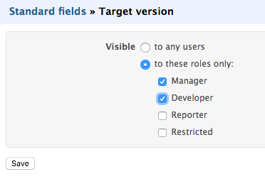

Redmine plugin - Let's customize core fields
============

This Redmine plugin lets you customize core fields behaviour.

You will be able to hide or show core fields based on the user roles per project.

Screenshot
------------

Installation
------------

This plugin is compatible with Redmine 2.1+ and has been successfully tested on Redmine 3.2.

Please apply general instructions for plugins [here](http://www.redmine.org/wiki/redmine/Plugins).

Note that this plugin now depends on this other plugin:
* **redmine_base_deface** [here](https://github.com/jbbarth/redmine_base_deface)

First download the source or clone the plugin and put it in the "plugins/" directory of your redmine instance. Note that this is crucial that the directory is named 'redmine_customize_core_fields'!

Then execute:

    $ bundle install
    $ rake redmine:plugins

And finally restart your Redmine instance.

Contributing
------------

1. Fork it
2. Create your feature branch (`git checkout -b my-new-feature`)
3. Commit your changes (`git commit -am 'Add some feature'`)
4. Push to the branch (`git push origin my-new-feature`)
5. Create new Pull Request
